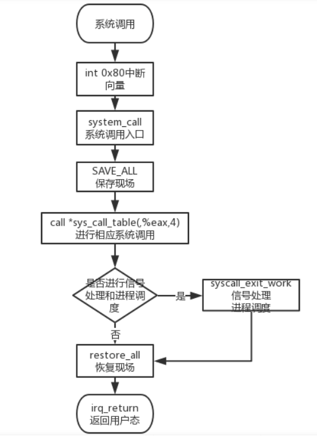

## 内核日志

### 原理

#### 系统调用过程

图片源自：https://blog.csdn.net/ven_kon/article/details/66476543



> 实现思路：
>
> - 使用模块加载(不用编译内核)
> - 例如对fork添加日志功能
>   - 将fork的服务例程换成我们自己编写的服务例程
>     - 在自己编写的服务例程里面做日志记录
>     - 再调用fork
>     - 最后返回
>
> 涉及问题
>
> 版本：Linux 5.11.0
>
> - sys_call_table替换服务例程
>   - 要将该表的权限设置为可写
> - 查找系统调用号
>   - 代码位置：/usr/include/x86_64-linux-gnu/asm/unistd_32.h
> - 系统调用表
>   - arch/x86/entry/syscalls/syscall_64.tbl
> - 调用原来的服务例程
>   - 保存原来的服务例程的地址后，需要进行类型转换才能调用
>   - 类型转换需要自己typedef一个类型
>     - 这个类型需要去找源码

1.sys_call_table地址

```shell
sudo cat /proc/kallsyms | grep sys_call_table
```

2.修改sys_call_table权限

- 修改控制寄存器cr0的第16位：写保护位

```c
unsigned int clear_and_return_cr0(void)
{
    unsigned int cr0 = 0;
    unsigned int ret;
    asm("mov %%cr0, %%rax":"=a"(cr0)); // 将cr0寄存器的值读取到rax，再将rax的值读取到变量cr0
    ret = cr0; // 保存原来的cr0
    cr0 &= 0xfffeffff; // 将第16位置0
    asm("mov %%rax, %%cr0" ::"a"(cr0)); //读取cr0的值到rax寄存器，再将rax寄存器的值放入cr0中
    return ret;
}

void setback_cr0(unsigned int val) 
{
    asm volatile("mov %%rax, %%cr0" ::"a"(val)); //读取val的值到rax寄存器，再将rax寄存器的值放入cr0中
}
```

Makefile

- 需要把<模块名>替换
- 例如sys_fork_audit.c 则模块名为sys_fork_audit

```makefile
obj-m := <模块名>.o
LINUX_KERNEL := $(shell uname -r)
KERNELDIR := /usr/src/linux-headers-$(LINUX_KERNEL)
PWD := $(shell pwd)
all:
	make -C $(KERNELDIR) M=$(PWD) modules 
clean:
	make -C $(KERNELDIR) M=$(PWD) clean
```

### fork

类型定义

```
typedef unsigned long (*MY_FORK)(void); 
```

完整代码

sys_fork_audit.c

```c
#include <linux/module.h>
#include <linux/kernel.h>

#define SYS_CALL_TABLE 0xffffffff95200300
#define SYS_CALL_ID 57
unsigned long *sys_call_table = SYS_CALL_TABLE;
unsigned long *orig_saved;
typedef unsigned long (*MY_FORK)(void);  // define function type 
MY_FORK my_fork;

unsigned int clear_and_return_cr0(void)
{
    unsigned int cr0 = 0;
    unsigned int ret;
    asm("mov %%cr0, %%rax":"=a"(cr0)); // 将cr0寄存器的值读取到rax，再将rax的值读取到变量cr0
    ret = cr0; // 保存原来的cr0
    cr0 &= 0xfffeffff; // 将第16位置0
    asm("mov %%rax, %%cr0" ::"a"(cr0)); //读取cr0的值到rax寄存器，再将rax寄存器的值放入cr0中
    return ret;
}

void setback_cr0(unsigned int val) 
{
    asm volatile("mov %%rax, %%cr0" ::"a"(val)); //读取val的值到rax寄存器，再将rax寄存器的值放入cr0中
}

// 自己的中断服务例程
asmlinkage long sys_mycall(void)
{
    printk(KERN_ALERT "syscall_log: call fork\n");
    my_fork = (MY_FORK)orig_saved;
    unsigned long pid = (*my_fork)();
    printk(KERN_ALERT "New process pid is:%lu\n",pid);

    return pid;
}

// 初始化模块，替换
static int syscall_init_module(void)
{
    printk(KERN_ALERT "Begin logging system calls.");
    orig_saved = (unsigned long *)(sys_call_table[SYS_CALL_ID]); //保存系统调用号SYS_CALL_ID的系统调用表的地址
    printk(KERN_ALERT "orig_saved : 0x%p\n", orig_saved);

    unsigned int ret = clear_and_return_cr0();
    sys_call_table[SYS_CALL_ID] = (unsigned long *)sys_mycall; //将系统调用号SYS_CALL_ID指向自己写的服务例程
    setback_cr0(ret);

    return 0;
}

// 移除模块，恢复
static void syscall_cleanup_module(void)
{
    printk(KERN_ALERT "Release system call logging.\n");

    unsigned int ret = clear_and_return_cr0();
    sys_call_table[SYS_CALL_ID] = (unsigned long *)orig_saved;
    setback_cr0(ret);
}

// 模块注册
module_init(syscall_init_module);
module_exit(syscall_cleanup_module);

MODULE_LICENSE("GPL");
MODULE_DESCRIPTION("mysyscall");
```

test.c

```c
#include <linux/unistd.h>
#include <syscall.h>
#include <sys/types.h>
#include <stdio.h>

int main(void)
{
	long pid = 0;
	pid = syscall(57);
    printf("%ld\n",pid);
    return 0;
}
```

Makefile

```makefile
obj-m := sys_fork_audit.o
LINUX_KERNEL := $(shell uname -r)
KERNELDIR := /usr/src/linux-headers-$(LINUX_KERNEL)
PWD := $(shell pwd)
all:
	make -C $(KERNELDIR) M=$(PWD) modules 
clean:
	make -C $(KERNELDIR) M=$(PWD) clean
```

运行

```shell
su #切换到管理员身份
make 
insmod sys_fork_audit.ko

dmesg #查看内核输出信息

gcc test.c -o test
./test
demsg #查看内核输出信息

remod sys_fork_audit
dmesg #查看内核输出信息
```

### open

```c
// int open( const char * pathname, int flags);
// int open( const char * pathname,int flags, mode_t mode);

/*
	注意：第一个参数必须用“双引号”，单引号会提示expected ‘const char *’ but argument is of type ‘int’而导致打开失败
*/
open("./hello.dat",O_RDWR);
```

sys_open_audit.c

```c
#include <linux/module.h>
#include <linux/kernel.h>

#define SYS_CALL_TABLE 0xffffffff9fe00300
#define SYS_CALL_ID 5
unsigned long *sys_call_table = SYS_CALL_TABLE;
unsigned long *orig_saved;
typedef int (*MY_OPEN)(const char * pathname,int flags, mode_t mode);  // define function type 
MY_OPEN my_open;

unsigned int clear_and_return_cr0(void)
{
    unsigned int cr0 = 0;
    unsigned int ret;
    asm("mov %%cr0, %%rax":"=a"(cr0)); // 将cr0寄存器的值读取到rax，再将rax的值读取到变量cr0
    ret = cr0; // 保存原来的cr0
    cr0 &= 0xfffeffff; // 将第16位置0
    asm("mov %%rax, %%cr0" ::"a"(cr0)); //读取cr0的值到rax寄存器，再将rax寄存器的值放入cr0中
    return ret;
}

void setback_cr0(unsigned int val) 
{
    asm volatile("mov %%rax, %%cr0" ::"a"(val)); //读取val的值到rax寄存器，再将rax寄存器的值放入cr0中
}

// 自己的中断服务例程
asmlinkage long sys_mycall(const char * pathname,int flags, mode_t mode)
{
    printk(KERN_ALERT "syscall_log: call open\n");
    my_open = (MY_OPEN)orig_saved;
    int fd = (*my_open)(pathname,flags,mode);

    return fd;
}

// 初始化模块，替换
static int syscall_init_module(void)
{
    printk(KERN_ALERT "Begin logging system calls.");
    orig_saved = (unsigned long *)(sys_call_table[SYS_CALL_ID]); //保存系统调用号SYS_CALL_ID的系统调用表的地址
    printk(KERN_ALERT "orig_saved : 0x%p\n", orig_saved);

    unsigned int ret = clear_and_return_cr0();
    sys_call_table[SYS_CALL_ID] = (unsigned long *)sys_mycall; //将系统调用号SYS_CALL_ID指向自己写的服务例程
    setback_cr0(ret);

    return 0;
}

// 移除模块，恢复
static void syscall_cleanup_module(void)
{
    printk(KERN_ALERT "Release system call logging.\n");

    unsigned int ret = clear_and_return_cr0();
    sys_call_table[SYS_CALL_ID] = (unsigned long *)orig_saved;
    setback_cr0(ret);
}

// 模块注册
module_init(syscall_init_module);
module_exit(syscall_cleanup_module);

MODULE_LICENSE("GPL");
MODULE_DESCRIPTION("mysyscall");
```

test.c

```c
#include <linux/unistd.h>
#include <syscall.h>
#include <stdio.h>
#include <sys/types.h>//这里提供类型pid_t和size_t的定义
#include <sys/stat.h>
#include <fcntl.h>

int main(void)
{
	long fd = 0;
    fd = open("./hello.dat",O_RDWR,0666);
    printf("%ld\n",fd);

    char buffer[80];
    int size;
    size=read(fd,buffer,sizeof(buffer));
    close(fd);
    printf("%s\n",buffer);
    return 0;
}
```

